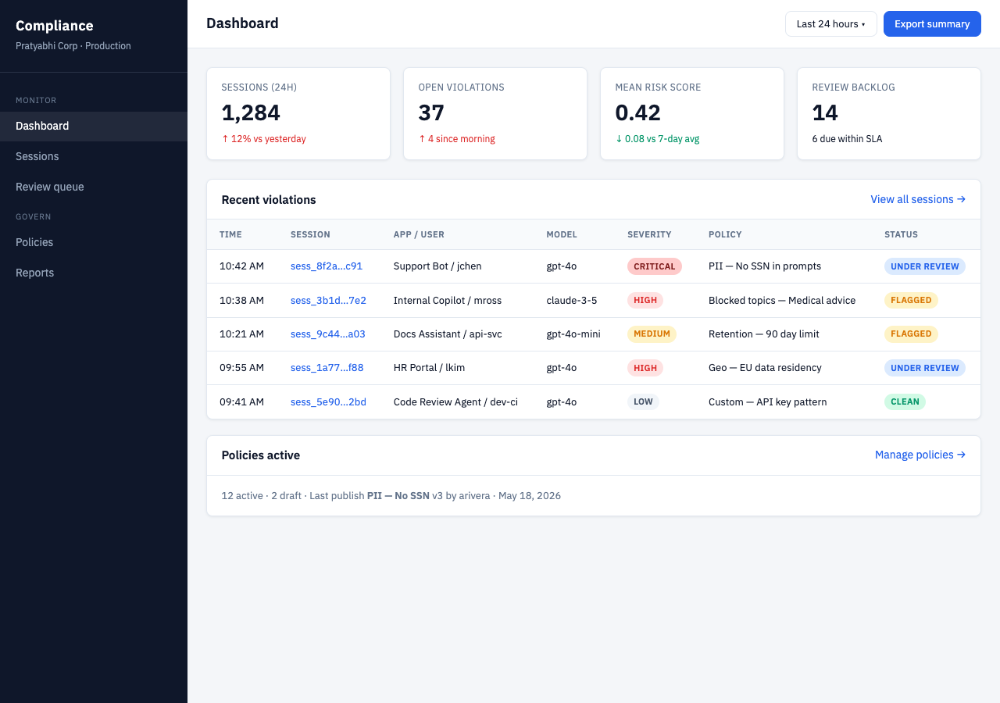

# Compliance dashboard:



```bash
## install sjs
npm install

## transpile scalajs to js, using a task defined in package.js
npm run sbtInit   ## downloads sbt into node_modules/sbt (via sjs-nodejs)

npm run sbtBuild  ## needs JRE; runs buildJs (fastOptJS + copy to resources)

 ## alias for sbtBuild
npm run sjs      
```

# run on nodejs

```bash
npm start
```

go to http://localhost:8080/

The Scala.js app implements the compliance UI (dashboard, sessions, policies, review, reports) with hash routing. Static HTML reference mockups remain at http://localhost:8080/mockups/.
